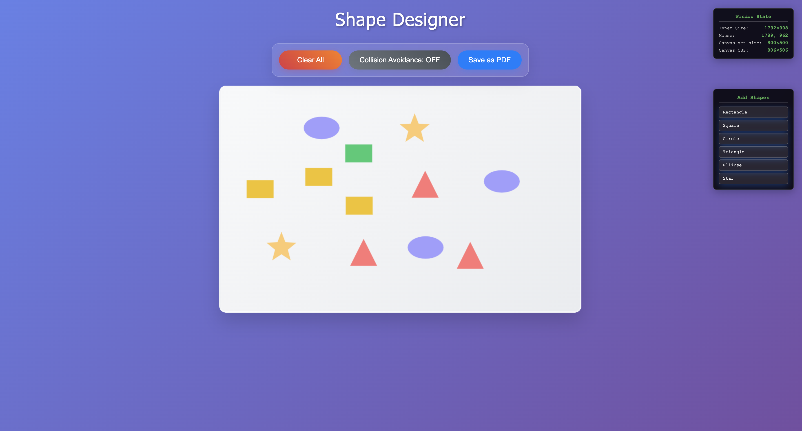
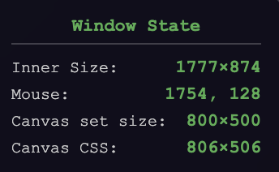
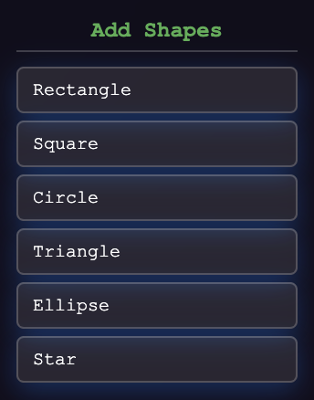

# Canvas Shape Designer

An interactive web application for creating and manipulating geometric shapes on an HTML5 canvas. Built with TypeScript and Vite.



## Features

### Core Functionality
- **Interactive Shape Creation**: Add various geometric shapes with a single click
- **Drag & Drop**: Click and drag shapes around the canvas
- **Shape Variety**: Support for rectangles, squares, circles, triangles, ellipses, and stars
- **Double-click Resizing**: Double-click any shape to randomly resize it

### Advanced Features
- **Collision Avoidance**: Toggle collision detection to prevent shapes from overlapping during movement
- **PDF Export**: Export your canvas creations as PDF files
- **Real-time Debugging**: Built-in window state monitor showing canvas dimensions, mouse position, and window metrics



## Quick start

### Prerequisites
- Node.js (version 16 or higher)
- npm or yarn package manager

### Installation
1. Clone the repository or navigate to the canvas directory
2. Install dependencies:
   ```bash
   npm install
   ```

### Development
Start the development server with hot reloading:
```bash
npm run dev
```
The application will be available at `http://localhost:3000`

## Usage guide

### Creating shapes
1. Use the shape buttons in the control panel to add shapes:
   - **Rectangle**: Colored rectangles with random dimensions
   - **Square**: Perfect squares in various colors
   - **Circle**: Solid circles with fixed radius
   - **Triangle**: Equilateral triangles pointing upward
   - **Ellipse**: Oval shapes with random proportions
   - **Star**: Five-pointed stars

<!-- Shape examples image -->


### Interacting with shapes
- **Move Shapes**: Click and drag any shape to reposition it
- **Resize Shapes**: Double-click a shape to randomly resize it
- **Clear Canvas**: Use the "Clear All" button to remove all shapes

### Collision avoidance
Toggle the collision avoidance feature to prevent shapes from overlapping:
- **OFF** (default): Shapes can be moved freely and may overlap
- **ON**: Shapes will resist movement that would cause collisions


### Export options
- **PDF Export**: Click "Save PDF" to download your canvas as a PDF file
- Exported files include timestamp in filename for easy organization

## Architecture

### Project structure
```
canvas/
├── src/
│   ├── app-initializer.ts    # Application bootstrap and event binding
│   ├── canvas-app.ts         # Main canvas application logic
│   ├── collision-utils.ts    # Collision detection algorithms
│   ├── debug-monitor.ts      # Real-time debugging information
│   ├── geometry-shapes.ts    # Shape class definitions and rendering
│   ├── pdf-export.ts         # PDF generation functionality
│   └── shape-factory.ts      # Shape creation and color management
├── index.html               # Main HTML structure
├── style.css               # Application styling
├── package.json            # Dependencies and scripts
├── tsconfig.json          # TypeScript configuration
└── vite.config.ts         # Vite build configuration
```

### Design features
- **Factory Pattern**: `ShapeFactory` creates shapes with consistent styling and positioning
- **Abstract Base Class**: All shapes inherit from the `Shape` abstract class
- **Single Responsibility**: Each module handles a specific concern


## Customization

### Adding New Shapes
1. Create a new shape class extending `Shape` in `geometry-shapes.ts`
2. Implement the required abstract methods
3. Add a factory method in `ShapeFactory`
4. Update the HTML and event listeners in `app-initializer.ts`

### Color Schemes
Modify color palettes in `ShapeFactory.DEFAULT_COLORS`:
```typescript
private static readonly DEFAULT_COLORS = {
    rectangle: ['#3498db', '#e74c3c', '#2ecc71', '#f1c40f'],
    // add your custom colors here
};
```

### Canvas styling
Adjust canvas appearance in `style.css` or modify canvas properties in `CanvasApp`.

## Development

### Technology Stack
- **TypeScript**: Type-safe development with modern ES features
- **Vite**: Lightning-fast build tool and development server
- **HTML5 Canvas**: High-performance 2D graphics rendering
- **jsPDF**: Client-side PDF generation
- **CSS3**: Modern styling with flexbox and grid layouts

---