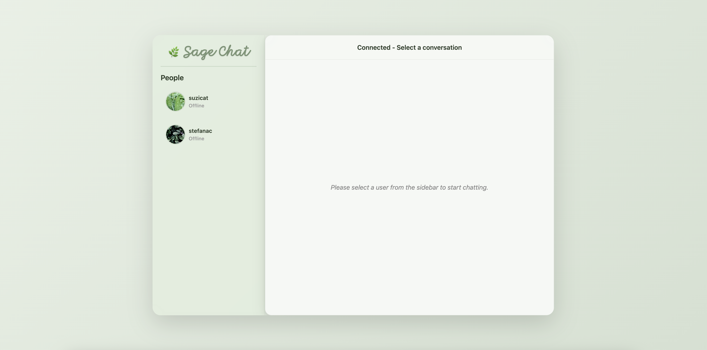
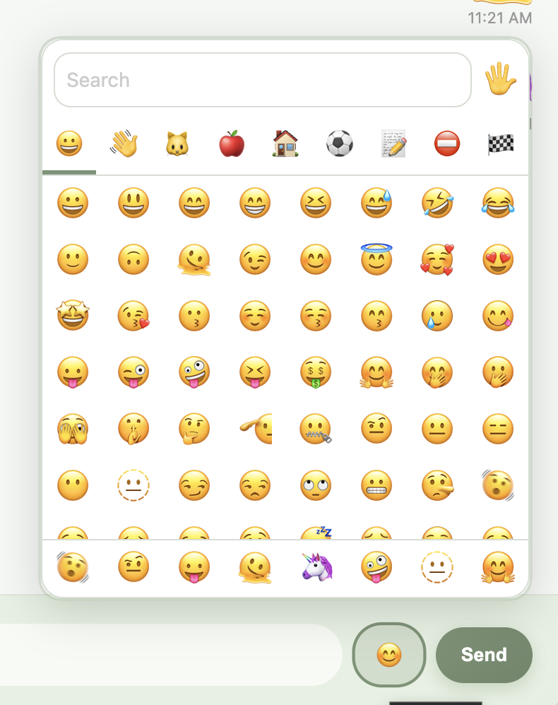
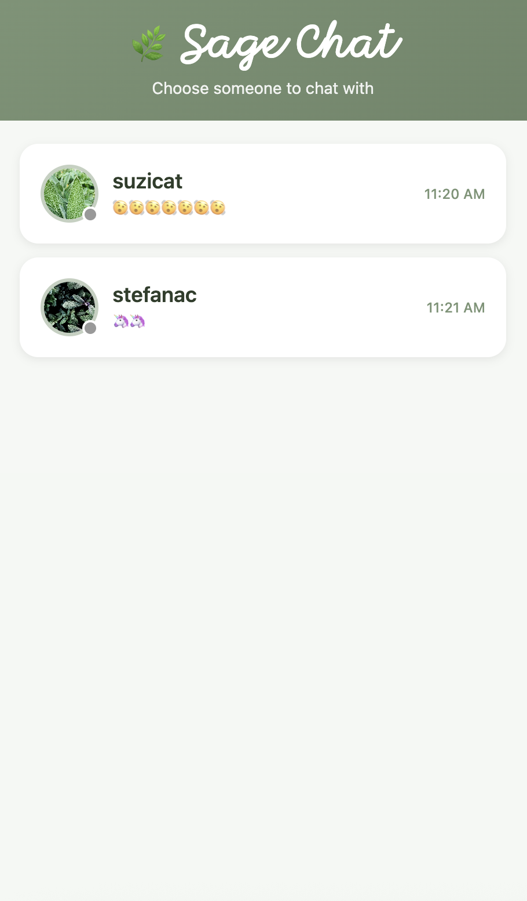
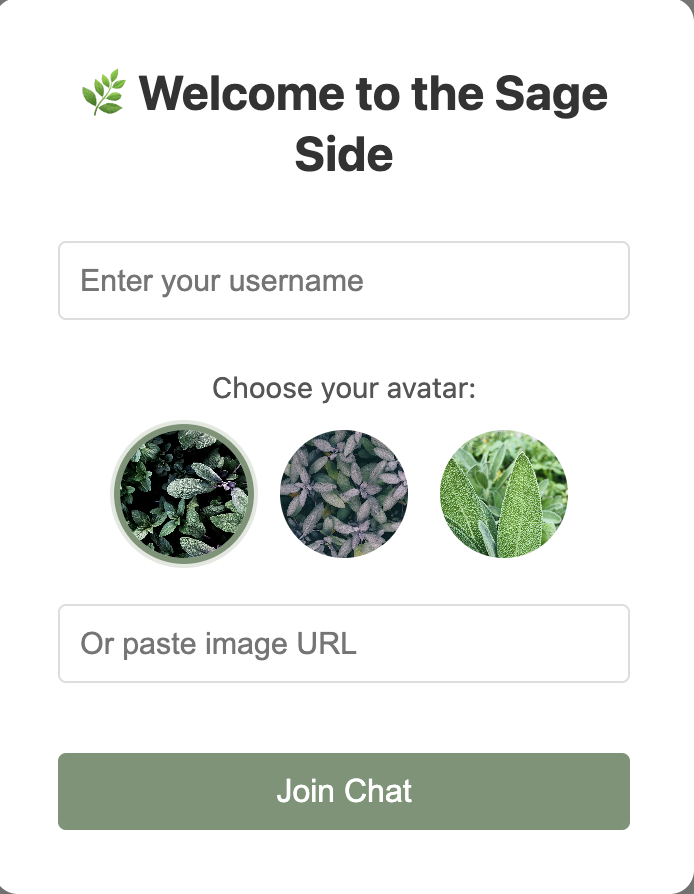
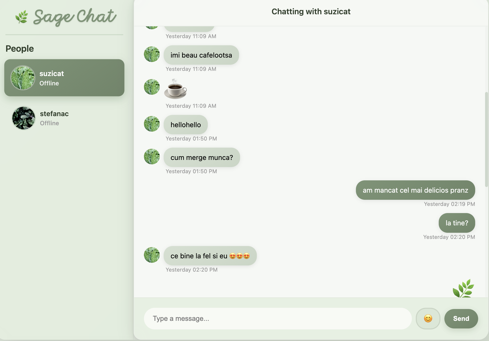
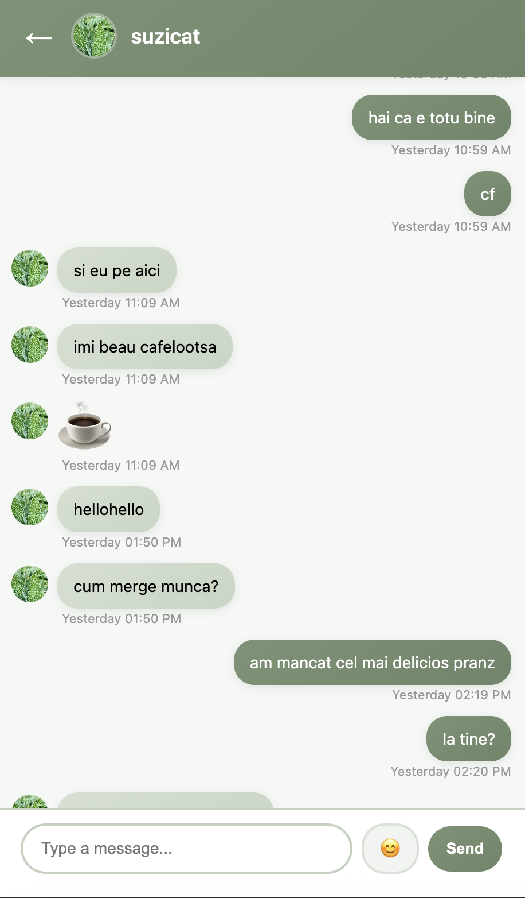

# Sage Chat 🌿

### Introducing Sage Chat, the best way to keep up with your friends.


## Overview

Sage Chat is a real-time messaging application built with WebSocket technology. 

With its nature-inspired green theme and intuitive interface, staying connected with friends has never been more pleasant.

Come join the Sage Side.


## Features

### Beautiful Design
- Nature-inspired sage green color scheme
- Clean, modern interface
- Custom avatar support - be creative and add your own profile picture!

### Real-Time Messaging
- Instant message delivery via WebSocket
- Chat history persistence

### Rich Communication
- **Emoji Picker**: Built-in emoji selector
- **Emoji-Only Messages**: Send large emojis without chat bubbles
- Search functionality for quick emoji access
- Categorized emojis (smileys, people, animals, food, travel, and more)



### Fully Responsive
- Seamless mobile experience
- Touch-optimized interface
- Adaptive layouts for all screen sizes
- Mobile-first design approach



### User Management
- Custom usernames and profile pictures
- Online/offline status indicators
- User list with last message preview (mobile)
- Avatar selection with image URL support

## Technology Stack

### Frontend
- **HTML5 & CSS3**: Modern web standards
- **SCSS**: Modular and maintainable stylesheets
- **Vanilla JavaScript**
- **emoji-picker-element**: Professional emoji picker library
- **WebSocket API**: Real-time bidirectional communication

### Backend
- **FastAPI**: High-performance Python web framework
- **WebSocket**: Full-duplex communication protocol
- **Redis Pub/Sub**
- **Uvicorn**: Fast server

## Project Structure

```
chat/
├── chat_frontend/          # Frontend application
│   ├── index.html         # Main HTML file
│   ├── css/               # Compiled CSS
│   ├── styles/            # SCSS source files
│   ├── scripts/           # JavaScript modules
│   │   ├── user_class.js
│   │   ├── websocket_client.js
│   │   ├── user_utilities.js
│   │   ├── mobile_utilities.js
│   │   └── emoji_picker.js
│   └── images/            # Assets and avatars
│
└── chat_backend/          # Backend application
    ├── main.py           # FastAPI application entry point
    ├── config.py         # Configuration settings
    ├── requirements.txt  # Python dependencies
    └── app/
        ├── services/     # Business logic
        └── websocket/    # WebSocket handlers
```

## Getting Started

### Prerequisites
- Python 3.8+
- Modern web browser
- SASS compiler (for stylesheet modifications)

### Backend Setup

1. Navigate to the backend directory:
```bash
cd chat_backend
```

2. Install dependencies:
```bash
pip install -r requirements.txt
```

3. Start the server:
```bash
./start_server.sh
# or
uvicorn main:app --reload --port 8000
```

### Frontend Setup

1. Navigate to the frontend directory:
```bash
cd chat_frontend
```

2. Compile SCSS (if making style changes):
```bash
sass styles/main.scss css/style.css --watch
```

3. Open `index.html` in your browser or serve via HTTP:
```bash
python -m http.server 8080
```

4. Access the application at `http://localhost:8080`




## Features in Detail

### Emoji Support
The application uses the `emoji-picker-element` library, providing:
- Full Unicode emoji support
- Search functionality
- Skin tone variations
- Recently used emojis
- Category organization

### Message Types
- **Text Messages**: Standard chat bubbles with timestamp
- **Emoji-Only Messages**: Large, bubble-free emoji display
- **Mixed Messages**: Text with inline emojis

## Development

### Compiling SCSS
```bash
cd chat_frontend
sass styles/main.scss css/style.css
```

### File Organization
- `_variables.scss`: Theme colors and spacing
- `_base.scss`: Base styles and resets
- `_layout.scss`: Layout and containers
- `_sidebar.scss`: User list styling
- `_messages.scss`: Message bubbles and chat
- `_inputs.scss`: Input fields and emoji picker
- `_mobile.scss`: Mobile-specific styles
- `_login.scss`: Login screen styles

## Screenshots

### Desktop Interface


### Mobile Interface



---

Built with 🌿 and ❤️
