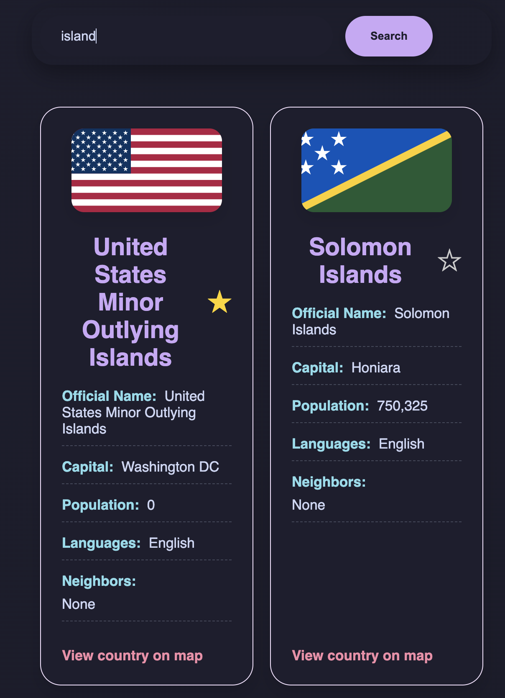
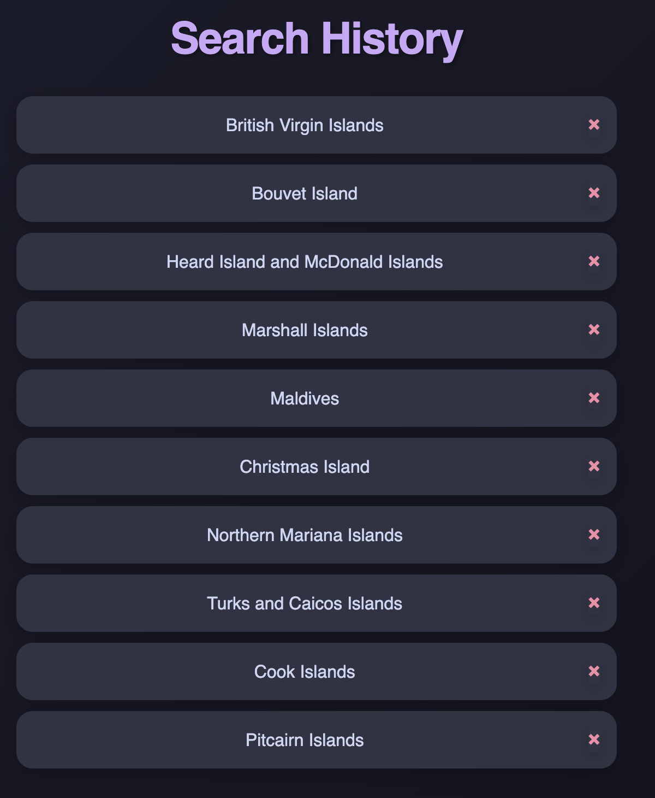
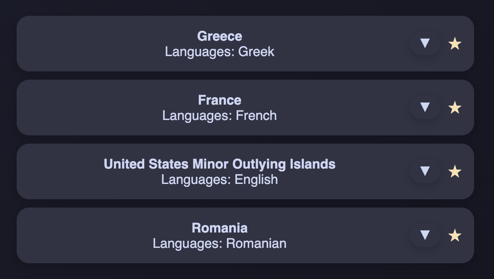

# Countries explorer

Discover countries and information about them, choose your favorites using the star icon to find out more about them.

## Functionalities

- Search for countries using the search bar. 

The results are going to be displayed below de search bar. If more results are found, multiple country cards will be shown.

- Search history: this is available by clicking the history tab on the navbar. The last 10 countries are displayed in the search history. Each element from the search history can be removed, if the user wants so.

- Add to favorites using the star button - starred countries will be available on the Starred section of the navbar. Here, more information on the starred countries is displayed, by clicking the drop-down button.

- Caching: cache refreshes every 24 hours, ensuring the latest info available, as well as high response speeds.
- Theme switcher: page is available in both light and dark theme.